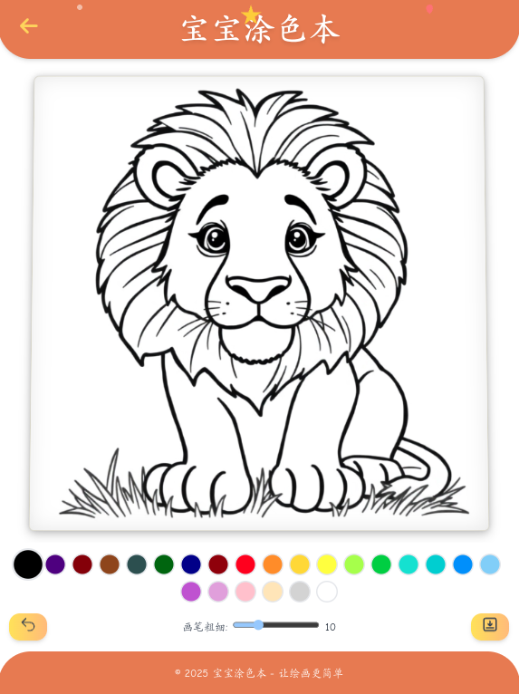

# Coloring-Book 宝宝涂色本

## 项目简介

Coloring-Book是一款专为宝宝设计的涂色本应用，旨在通过互动和乐趣的方式帮助宝宝学习绘画。应用内置了多种主题的线稿图片，让宝宝在涂色过程中发挥创造力，享受绘画的乐趣。

## 功能特点

1. **多种主题线稿图**：应用内置了多种不同主题的线稿图片，如动物、植物、交通工具等，满足不同宝宝的涂色需求。

2. **24色画笔可选**：提供了24种不同颜色的画笔，让宝宝可以自由选择喜欢的颜色进行涂色。

3. **涂色卡图片下载**：完成涂色后，宝宝可以将自己的作品保存为图片，方便家长打印或分享。

## 技术栈

- **前端框架**：Angular

- **移动应用框架**：Ionic

## 使用说明

1. **下载安装**：用户可以通过应用商店或官方网站下载并安装Coloring-Book应用。

2. **选择主题**：打开应用后，宝宝可以在主界面选择喜欢的主题线稿图。

3. **开始涂色**：选择线稿图后，宝宝可以使用不同的画笔和颜色进行涂色。

4. **保存分享**：完成涂色后，宝宝可以将作品保存为图片，并可以选择分享给家人或朋友。

## 截图

